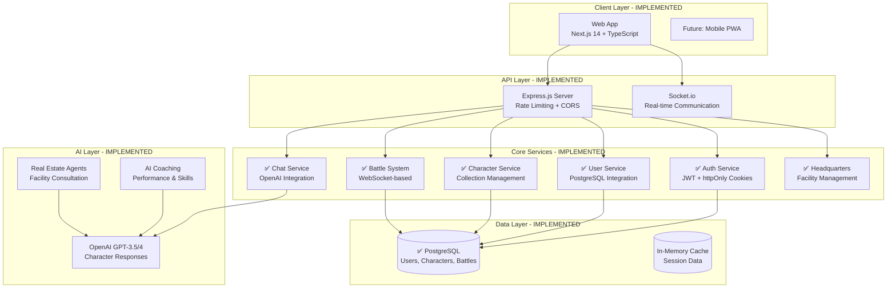

# Blank Wars - Current Architecture Overview (Updated)

## Date: July 19, 2025
## Status: Reflects implemented features and current system state

---

## 1. System Architecture Overview



---

## 2. Implemented Frontend Architecture

### Current Web Application Structure
```typescript
// ✅ IMPLEMENTED - Tech Stack
{
  framework: "Next.js 14 (App Router)",
  styling: "Tailwind CSS + Framer Motion",
  state: "React Context + useState/useEffect",
  realtime: "Socket.io Client",
  authentication: "httpOnly Cookies + JWT",
  deployment: "Vercel"
}

// ✅ IMPLEMENTED - Current Route Structure
/app
├── page.tsx                    // Main game dashboard
├── coach/page.tsx             // Coach progression system
├── game/page.tsx              // Battle arena
├── test-chat/page.tsx         // Chat testing
├── test-facilities/page.tsx   // HQ facilities testing
└── debug-test/page.tsx        // Development testing
```

### Main Tab System (Core UI)
```typescript
// ✅ IMPLEMENTED - Main Navigation Tabs
const implementedTabs = {
  coach: {
    subTabs: [
      "front-office",      // ✅ Coach progression dashboard
      "team-dashboard",    // ✅ Team stats overview
      "performance-coaching", // ✅ 1-on-1 combat training
      "individual-sessions",  // ✅ Personal life coaching
      "financial-advisory",   // ✅ Financial management
      "therapy",             // ✅ Character therapy sessions
      "group-events"         // ✅ Team building activities
    ]
  },
  
  characters: {
    subTabs: [
      "progression",    // ✅ Character leveling & stats
      "equipment",      // ✅ Weapons & armor + AI advisor
      "abilities"       // ✅ Skills & abilities + AI coach
    ]
  },
  
  headquarters: {
    subTabs: [
      "overview"        // ✅ Team base + facility management
    ]
  },
  
  training: {
    subTabs: [
      "activities",     // ✅ Daily training sessions
      "progress",       // ✅ Training progress tracking
      "membership"      // ✅ Training tier subscriptions
    ]
  },
  
  battle: {
    subTabs: [
      "team-arena",     // ✅ 3v3 combat system
      "gameplan",       // ✅ Strategy tracking
      "teams",          // ✅ Team building
      "packs"           // ✅ Character pack opening
    ]
  },
  
  social: {
    subTabs: [
      "clubhouse"       // ✅ Community features
    ]
  },
  
  store: {
    subTabs: [
      "merch"           // ✅ Merchandise purchasing
    ]
  }
};
```

---

*This document reflects the actual implemented state as of July 19, 2025. The project has moved from architectural planning to a functional, deployable application with core features working.*